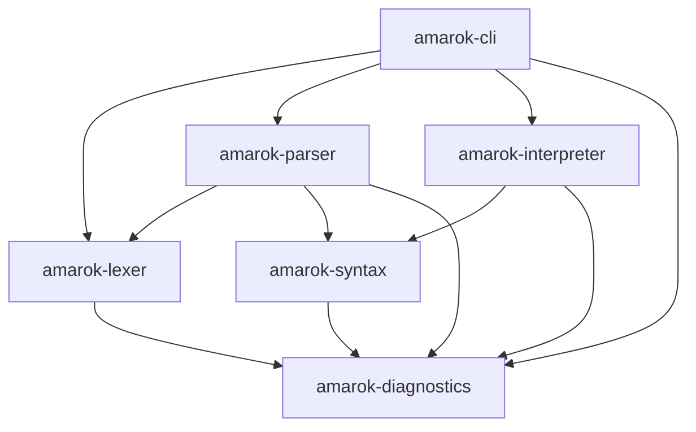
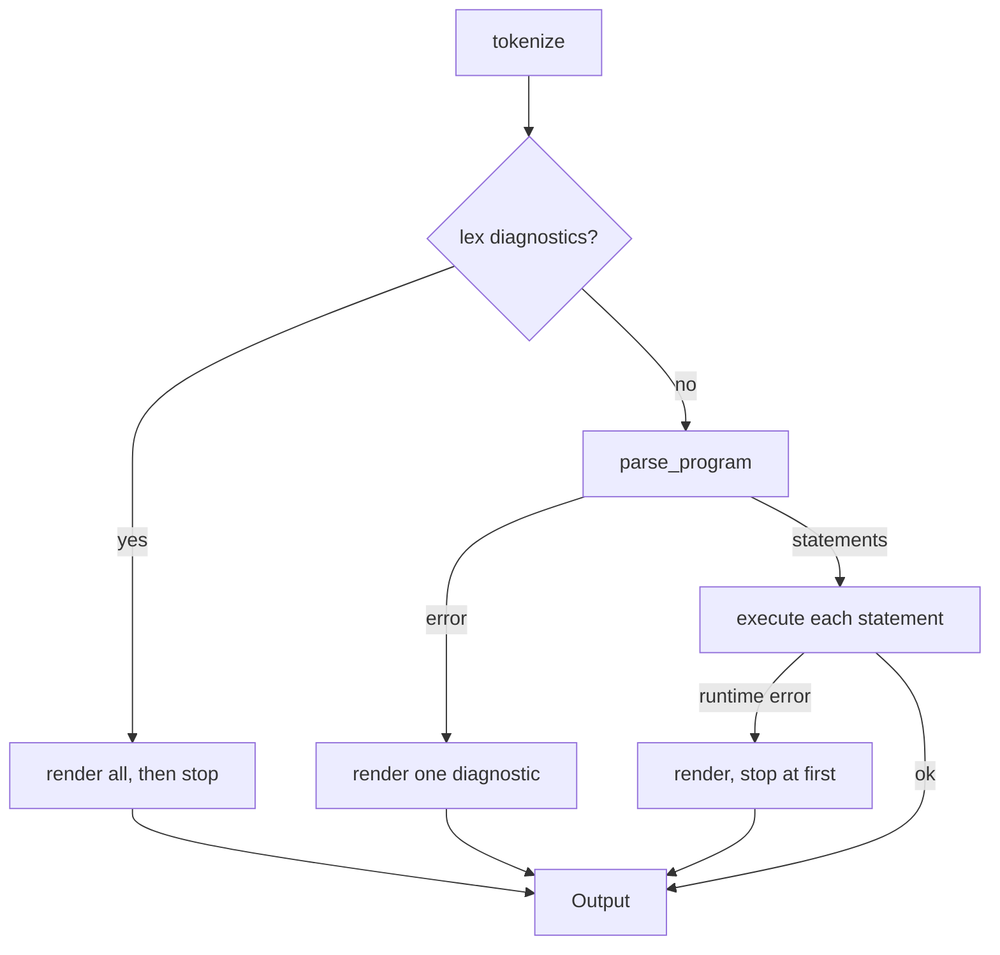

# Architecture

Amarok is a Cargo workspace. The root `Cargo.toml` lists every crate under
`crates/`:

```toml
[workspace]
members = ["crates/*"]
resolver = "2"
```

Each crate corresponds to one stage of the interpreter, plus two "spine" crates
that the stages share. Splitting the stages into separate crates keeps their
boundaries explicit: the lexer cannot reach into the parser, the parser cannot
reach into the interpreter, and the shared vocabulary — tokens, AST nodes, source
positions, errors — lives in crates that the stages depend on rather than inside
any one stage.

## Crate dependencies



The graph is acyclic and points one way. Two crates sit at the bottom and carry
no logic of their own, only shared data types:

- **[`amarok-diagnostics`](diagnostics.md)** — `SourcePosition` and `Diagnostic`.
  Every other crate depends on it, because every stage needs to point at a
  location in the source when something goes wrong.
- **[`amarok-syntax`](syntax.md)** — the AST (`Expression`, `Statement`, and the
  operator enums). It is produced by the parser and consumed by the interpreter,
  so it belongs to neither; it depends only on `diagnostics`, since each node
  carries a position.

## The driver: `amarok-cli`

`amarok-cli` is the only crate that depends on all the stages. It contains the
`amarok` binary and the orchestration that threads a program through the
pipeline.

### Entry point (`main.rs`)

`main` takes a single command-line argument — a path — loads the file, runs it,
and prints any output. It uses two BSD `sysexits` codes to distinguish failures:

| Exit code | Meaning |
|-----------|---------|
| `0` | Success |
| `64` | Usage error — wrong number of arguments |
| `66` | Could not open or read the input file |

### Orchestration (`run_source`)

`run_source(source) -> String` chains the stages together, and in doing so
defines amarok's error policy:



1. **Lex.** If `tokenize` reports *any* diagnostics, they are all rendered and the
   program stops before parsing.
2. **Parse.** `parse_program` returns either the list of statements or a single
   diagnostic, which is rendered.
3. **Execute.** Each statement runs against a single global environment. The value
   of an expression statement is collected for output; the first runtime error is
   rendered and stops execution.

Because there is no output statement, the value of each expression statement is
printed directly — this is how the example on the [home page](index.md) produces
`15` and `30`.

Errors from every stage are turned into human-readable text by
[`render`](diagnostics.md), so the driver never has to know how a caret is drawn.

> The per-crate API is also documented in the rustdoc built by
> `cargo doc --no-deps --document-private-items`, which CI publishes alongside
> these pages.
