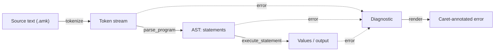

# Amarok Internals

Amarok is a small, educational, dynamically-typed scripting language with a
tree-walking interpreter written in Rust. The project is organized as a Cargo
workspace whose crates mirror the stages of a classic interpreter pipeline:
source text is **scanned** into tokens, **parsed** into an abstract syntax tree
(AST), and then **evaluated** by walking that tree.

These pages are an architectural overview for contributors and maintainers — the
high-level "how it fits together" map that complements the API-level reference
generated by `cargo doc`. They describe the implementation as it exists today.

## The pipeline at a glance



Each stage either produces the input for the next stage or fails with a
[`Diagnostic`](diagnostics.md) — a message plus a source position — which the
driver renders with a `^` caret under the offending code.

## Crates

| Crate | Role |
|-------|------|
| [`amarok-diagnostics`](diagnostics.md) | Source positions and error values shared by every stage |
| [`amarok-lexer`](lexer.md) | Turns source text into a stream of tokens |
| [`amarok-syntax`](syntax.md) | The AST data model the parser produces and the interpreter consumes |
| [`amarok-parser`](parser.md) | Builds the AST from tokens by recursive descent |
| [`amarok-interpreter`](interpreter.md) | Walks the AST to produce values |
| `amarok-cli` | The `amarok` binary; wires the stages together (see [Architecture](architecture.md)) |

## A taste of the language

```
let x = 5;
let y = 10;
x + y;
(x + y) * 2;
```

Running this program prints:

```
15
30
```

A `let` declaration binds a name in the current scope and produces no output; a
bare expression statement prints its value.

## Where to go next

- [Architecture](architecture.md) — how the crates fit together and how the
  `amarok` binary drives them.
- [Diagnostics](diagnostics.md) — the shared error model every stage relies on.
- The front end: [Lexer](lexer.md) → [Syntax & AST](syntax.md) →
  [Parser](parser.md).
- The back end: [Interpreter](interpreter.md).
