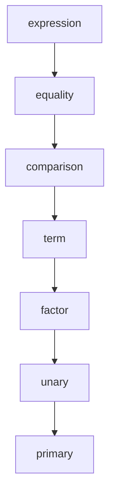

# Parser

`amarok-parser` builds an [AST](syntax.md) from the [lexer](lexer.md)'s tokens by
recursive descent. It exposes two entry points:

- `parse(tokens) -> Result<Expression, Diagnostic>` — parse a single expression
  and require the stream to end afterwards.
- `parse_program(tokens) -> Result<Vec<Statement>, Diagnostic>` — parse zero or
  more statements up to end of input.

Internally a `Parser` holds the token vector and a cursor, with `advance`, `peek`,
and `consume` helpers. `consume` expects a particular token kind and, if it isn't
there, produces a [`Diagnostic`](diagnostics.md) pointing the caret at the token
that *was* found.

## Expression grammar and precedence

Expressions are parsed as a ladder of functions, each handling one precedence
level and delegating to the next-tighter-binding level below it. From loosest to
tightest:

In order, the levels match: equality (`==`, `!=`), comparison (`<`, `<=`, `>`,
`>=`), term (`+`, `-`), factor (`*`, `/`), and unary prefixes (`-`, `not`);
`primary` is the base case.

Each binary level is built from the same helper,
`parse_left_associative_binary`, given a function that recognizes the operators
for that level and a function that parses its operands. It parses one operand,
then folds in `(operator, operand)` pairs as long as a matching operator keeps
appearing — which makes the operators **left-associative**, so `a - b - c` parses
as `(a - b) - c`. As it consumes each operator it captures that operator's
position, so a later runtime error can point at it.

`unary` handles a prefix `-` or `not` and recurses into itself, so prefixes can
stack. `primary` is the base case: number, string, boolean, and `nil` literals, a
variable name, or a parenthesized expression. Parentheses recurse back to the top
of the ladder and add no node of their own — grouping changes how the tree is
shaped, not which nodes it contains.

## Statements

`parse_program` repeatedly calls `parse_statement`, which dispatches on the
leading token:

| Leading token | Statement | Shape |
|---------------|-----------|-------|
| `let` | declaration | `let name = expression ;` |
| `{` | block | `{ statement* }` |
| anything else | expression statement | `expression ;` |

A block parses statements until it reaches the matching `}` (or end of input).
The declaration and expression-statement forms both finish by `consume`-ing the
trailing `;`.

## Error handling

The parser stops at the **first** error: every step returns a `Result`, and a
failure propagates straight out as a single `Diagnostic`. There is no recovery or
resynchronization here — a contrast with the [lexer](lexer.md), which collects
multiple errors and keeps scanning.
